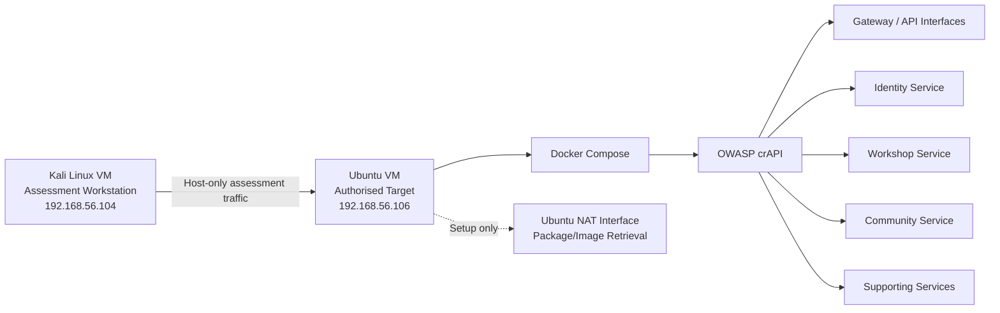
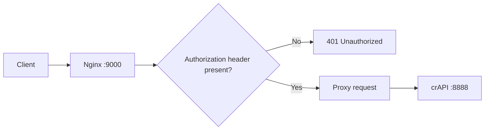

# OWASP crAPI Security Assessment

> **Three-day, hypothesis-driven API security assessment of OWASP crAPI in a privately owned VirtualBox lab.**

[](#)
[](#)
[](#)
[](#)
[](#)

## Overview

This repository documents my end-to-end security assessment of **OWASP crAPI**, an intentionally vulnerable API application deployed inside a private lab that I own and control.

The goal of this project was not to produce the longest vulnerability list or rely on automated scanner output. I used a focused security-assessment workflow:

```text
Define scope → map the attack surface → form hypotheses → test safely
→ validate evidence → assess risk → remediate → re-test → document residual risk
```

The assessment concentrated on authentication, object-level authorization, input validation, API business logic, supporting-service exposure, remediation, and defensive follow-up.

### Key result

Three reproducible security findings were confirmed during the assessment:

| ID | Finding | Severity | Final status |
|---|---|---:|---|
| **F-01** | Broken Authentication on Order Retrieval | **Critical** | Confirmed, re-tested, mitigated with a demonstrated gateway-level compensating control |
| **F-02** | Object-Level Authorization Failure / BOLA | **High** | Confirmed; source-level ownership validation proposed |
| **F-03** | Business-Logic Flaw in Order Quantity Handling | **High** | Confirmed; bounds validation proposed |
| **H-04** | Supporting-Service Exposure | Observation | Investigated; no crAPI vulnerability confirmed |

The most significant issue allowed an unauthenticated client with network access to the lab application to retrieve order data from a sensitive API endpoint without a valid session or bearer token.

---

## Ethical and Authorisation Statement

All testing in this repository was performed only against infrastructure that I own and control.

- **Assessment workstation:** Kali Linux VM
- **Authorised target:** Private Ubuntu VM running OWASP crAPI through Docker Compose
- **Testing network:** VirtualBox host-only network
- **Public/third-party systems:** Not tested
- **Production data:** Not used
- **Real user accounts:** Not used
- **Destructive testing:** Not performed
- **Credential theft / persistence / malware:** Not performed
- **Denial-of-service testing:** Not performed

This repository is intended as a **defensive cybersecurity portfolio project** and evidence-backed technical assessment.

---

## Lab Architecture



A dedicated VirtualBox host-only network was used for assessment traffic. The Ubuntu target also had NAT connectivity for ordinary setup tasks such as retrieving packages and container images, but the active assessment path remained the private host-only interface.

---

## Environment

| Component | Purpose |
|---|---|
| Kali Linux VM | Security assessment workstation |
| Ubuntu 24.04 LTS VM | Single authorised target |
| VirtualBox | Isolated virtual lab |
| Docker / Docker Compose | crAPI deployment |
| OWASP crAPI | Intentionally vulnerable API application |
| Burp Suite Community | HTTP history and request replay |
| curl | Controlled request validation and re-testing |
| Nmap | Targeted service validation |
| Nginx | Day 3 compensating control for F-01 |

### Relevant exposed interfaces observed during the assessment

| Port | Service / role | Assessment treatment |
|---:|---|---|
| 22/tcp | OpenSSH | Observed; credential attacks intentionally out of scope |
| 8025/tcp | MailHog | Reviewed as supporting-service exposure |
| 8443/tcp | HTTPS/OpenResty | crAPI interface |
| 8888/tcp | crAPI HTTP interface | Main finding-validation path |
| 30080/tcp | Duplicate published mapping | Validated as same application surface |
| 30443/tcp | Duplicate published mapping | Validated as same application surface |

---

## Assessment Strategy

I used a hypothesis-driven approach rather than broad scanning.

For each important test, I attempted to follow the same logic:

1. Establish a normal baseline.
2. Change one meaningful variable.
3. Compare the response against expected secure behaviour.
4. Reproduce the behaviour where feasible.
5. Consider alternative explanations and false positives.
6. Record only what the evidence supports.
7. Separate technical behaviour from practical impact.
8. Propose or demonstrate remediation.
9. Re-test the important improvement where feasible.
10. Document residual risk and limitations honestly.

### Initial hypotheses

| Hypothesis | Security question | Priority |
|---|---|---:|
| **H-01** | Can one authenticated user access another user's objects by changing an identifier? | High |
| **H-02** | Are authentication and token requirements actually enforced on protected API requests? | High |
| **H-03** | Can unexpected values cause security-relevant business-logic behaviour? | Medium-High |
| **H-04** | Do supporting interfaces expose meaningful information or unnecessarily expand the attack surface? | Medium |

---

# Findings

## F-01 — Broken Authentication on Order Retrieval

**Severity:** Critical  
**Endpoint:** `GET /workshop/api/shop/orders/{id}`  
**Security area:** Authentication / API access control

### What I tested

A protected order-retrieval endpoint was requested without an `Authorization` header, cookie, or valid session state.

### Expected secure behaviour

The API should reject the request before processing the object identifier, normally with an authentication failure such as `401 Unauthorized`.

### Observed behaviour

The endpoint returned `HTTP 200 OK` and disclosed a complete order object from the lab dataset.

The behaviour was reproduced across more than one lab-created order, confirming that the result was not limited to a single accidental object.

### Why it matters

An unauthenticated client that can reach the vulnerable interface could retrieve order information without first proving identity. Sequential object identifiers make this especially important because they lower the effort required to request additional records.

### Evidence

- `03_EVIDENCE/screenshots/D3-E-001_AND_D3-E-008_F01_RETEST_AND_BEFORE_AFTER.png`
- Day 2 and Day 3 assessment reports
- `02_TESTING/test_cases/TC_F01_BROKEN_AUTHENTICATION.pdf`

### Defensive response

A gateway-level Nginx compensating control was deployed on a parallel port during Day 3 to demonstrate authentication enforcement in front of the vulnerable route.

The control:

- rejects requests to the protected order route when the `Authorization` header is missing;
- forwards authenticated requests to the backend;
- preserves the original backend on port 8888 for before/after comparison;
- allows regression testing of legitimate requests through the gateway.

### Important limitation

The demonstrated Nginx rule checks for the **presence** of an `Authorization` header. It is not a complete substitute for application-level JWT validation, token verification, and consistent authorization middleware.

---

## F-02 — Object-Level Authorization Failure / BOLA

**Severity:** High  
**Endpoint:** `GET /workshop/api/shop/orders/{id}`  
**Security area:** Object-level authorization

### What I tested

Two lab-only accounts were created: User A and User B. Each created its own order so ownership could be established before authorization testing.

A normal User A request was captured using User A's valid bearer token. Only the object identifier in the URL was changed so that the request referred to an order belonging to User B.

### Expected secure behaviour

The API should verify that the authenticated subject is authorized to access the requested object and return `403 Forbidden` or `404 Not Found` when the ownership check fails.

### Observed behaviour

The API returned `HTTP 200 OK` with User B's order data while the request was authenticated as User A.

The substituted request was reproduced multiple times.

### Root cause

The endpoint does not enforce a reliable ownership relationship between:

```text
Authenticated user identity → Requested object → Object owner
```

### Recommended remediation

Add explicit object-level authorization after authentication:

```text
1. Validate the bearer token.
2. Resolve the authenticated subject/user ID.
3. Load the requested order.
4. Compare order.owner_id with authenticated_user.id.
5. Deny the request if the relationship does not match.
```

Authentication and object authorization must remain separate controls. Fixing F-01 alone does not fix F-02.

### Evidence

- `03_EVIDENCE/screenshots/D2-H01-E01_F02_USER_A_BASELINE.png`
- `03_EVIDENCE/screenshots/D2-H01-E04_F02_CROSS_USER_RESPONSE.png`
- `03_EVIDENCE/screenshots/D2-H01-E05_F02_REPRODUCTION_1.png`
- `03_EVIDENCE/screenshots/D2-H01-E05_F02_REPRODUCTION_2.png`
- `02_TESTING/test_cases/TC_F02_BOLA.pdf`

---

## F-03 — Business-Logic Flaw in Order Quantity Handling

**Severity:** High  
**Endpoint:** `POST /workshop/api/shop/orders`  
**Security area:** Input validation / business logic

### What I tested

A valid order-creation request was used as the baseline. The `quantity` field was then changed one value at a time using deliberately selected test values rather than high-volume fuzzing.

Examples included:

- valid positive integer;
- `null`;
- string value;
- empty value;
- negative integer;
- extremely large positive integer.

### Expected secure behaviour

The API should enforce a sane positive range before quantity reaches balance or order calculations.

### Observed behaviour

Type/empty checks rejected some malformed values, but negative and extreme numerical values demonstrated security-relevant business-logic behaviour. In the lab test account, a negative quantity altered the account balance in an unintended direction, while an extreme quantity produced an unrealistic large negative balance state.

### Recommended remediation

Validate at the trust boundary:

```text
quantity must be an integer
quantity >= MIN_ALLOWED_QUANTITY
quantity <= MAX_ALLOWED_QUANTITY
```

Validation should occur before any balance, price, inventory, or order-state calculation.

### Day 3 limitation

A clean fresh-account re-test of the original F-03 exploit path was not completed inside the three-day window. The previously used account retained an abnormal balance from Day 2, so the Day 3 response could not be treated as proof that the underlying flaw was fixed.

That limitation is intentionally preserved in the report rather than overstated.

### Evidence

- Day 2 report and evidence register
- `02_TESTING/test_cases/TC_F03_QUANTITY_VALIDATION.pdf`
- `04_REMEDIATION/patches/F03_QUANTITY_BOUNDS_VALIDATION_PROPOSAL.pdf`

---

## H-04 — Supporting-Service Exposure Review

**Final treatment:** Observation; not scored as a confirmed crAPI vulnerability.

Supporting interfaces and published mappings were reviewed to understand whether they created meaningful risk.

The assessment confirmed that ports `30080` and `30443` represented duplicate mappings of the same crAPI application rather than separate unexpected services. An unrelated adjacent environment on the Ubuntu host was observed while troubleshooting, but it was deliberately treated as out of scope and was not investigated further.

This distinction is important: **an exposed service or unusual port is not automatically a vulnerability.**

---

# Remediation and Re-Test

## Demonstrated F-01 compensating control

The Day 3 hardening exercise used Nginx as a reverse proxy in front of the vulnerable order-retrieval path.

High-level request flow:



The original application on port `8888` remained unchanged so the pre-fix vulnerability could still be compared with the protected path.

### Validation performed

```text
Original backend :8888 + no auth  → vulnerable behaviour remains reproducible
Gateway path     :9000 + no auth  → request blocked
Gateway path     :9000 + auth     → legitimate request allowed
```

This showed that the compensating control was not simply blocking all traffic.

### Related repository artifacts

- `04_REMEDIATION/hardening/F01_NGINX_COMPENSATING_CONTROL.conf`
- `04_REMEDIATION/hardening/F01_IMPLEMENTATION_AND_VALIDATION.pdf`
- `04_REMEDIATION/patches/F02_OBJECT_OWNERSHIP_CHECK_PROPOSAL.pdf`
- `04_REMEDIATION/patches/F03_QUANTITY_BOUNDS_VALIDATION_PROPOSAL.pdf`
- `04_REMEDIATION/detection/DETECTION_MONITORING_RECOMMENDATIONS.pdf`

---

# Assessment Timeline

## Day 1 — Threat Intelligence and Exploration

Day 1 established the evidence baseline before meaningful security testing.

Work included:

- defining scope and authorisation;
- documenting exclusions and stop conditions;
- establishing Kali and Ubuntu system/network baselines;
- validating the private assessment path;
- deploying and validating OWASP crAPI;
- mapping reachable services;
- documenting architecture and assets;
- identifying four security hypotheses;
- building the Day 2 controlled test plan.

**Deliverable:** `02_TESTING/methodology/01_DAY1_SECURITY_ASSESSMENT_REPORT.pdf`

## Day 2 — Controlled Security Testing

Day 2 converted the Day 1 hypotheses into reproducible tests.

Work included:

- targeted service reconfirmation;
- manual request analysis;
- Burp Repeater object-ID substitution;
- authentication enforcement testing;
- input-validation testing with controlled values;
- supporting-service review;
- false-positive and alternative-explanation analysis;
- severity reasoning;
- evidence capture and finding validation.

**Deliverable:** `02_TESTING/methodology/02_DAY2_SECURITY_ASSESSMENT_REPORT.pdf`

## Day 3 — Validation, Hardening and Reporting

Day 3 focused on strengthening the evidence and showing defensive improvement.

Work included:

- re-testing the highest-priority finding;
- reviewing false-positive explanations and limitations;
- deploying Nginx as a compensating control for F-01;
- demonstrating before/after behaviour;
- performing a regression check for legitimate authenticated traffic;
- documenting proposed fixes for F-02 and F-03;
- documenting residual risk;
- preparing the final assessment package.

**Deliverable:** `02_TESTING/methodology/03_DAY3_SECURITY_ASSESSMENT_REPORT.pdf`

---

# Evidence Gallery

## Lab architecture


## Targeted service validation


## BOLA baseline


## Cross-user authorization result


## F-01 before / after remediation


## Authenticated regression check


A full evidence map is available in:

- `03_EVIDENCE/findings/EVIDENCE_INDEX.pdf`
- `03_EVIDENCE/findings/EVIDENCE_INDEX.md`

---

# Repository Structure

```text
OWASP-crAPI-Security-Assessment/
│
├── README.md
├── SECURITY.md
├── 01_FINAL_REPORT.pdf
│
├── 02_TESTING/
│   ├── configurations/
│   │   ├── LAB_SCOPE_AND_TARGETS.md
│   │   └── LAB_SCOPE_AND_TARGETS.pdf
│   ├── methodology/
│   │   ├── 01_DAY1_SECURITY_ASSESSMENT_REPORT.pdf
│   │   ├── 02_DAY2_SECURITY_ASSESSMENT_REPORT.pdf
│   │   ├── 03_DAY3_SECURITY_ASSESSMENT_REPORT.pdf
│   │   ├── METHODOLOGY_SUMMARY.md
│   │   └── METHODOLOGY_SUMMARY.pdf
│   ├── scripts/
│   │   └── reproduction_examples.sh
│   └── test_cases/
│       ├── TC_F01_BROKEN_AUTHENTICATION.md
│       ├── TC_F01_BROKEN_AUTHENTICATION.pdf
│       ├── TC_F02_BOLA.md
│       ├── TC_F02_BOLA.pdf
│       ├── TC_F03_QUANTITY_VALIDATION.md
│       ├── TC_F03_QUANTITY_VALIDATION.pdf
│       ├── TC_H04_SUPPORTING_SERVICE_REVIEW.md
│       └── TC_H04_SUPPORTING_SERVICE_REVIEW.pdf
│
├── 03_EVIDENCE/
│   ├── diagrams/
│   │   └── DAY1_LAB_ARCHITECTURE_PAGE.png
│   ├── findings/
│   │   ├── EVIDENCE_INDEX.md
│   │   └── EVIDENCE_INDEX.pdf
│   └── screenshots/
│       └── selected reproducible evidence images
│
├── 04_REMEDIATION/
│   ├── hardening/
│   │   ├── F01_NGINX_COMPENSATING_CONTROL.conf
│   │   ├── F01_IMPLEMENTATION_AND_VALIDATION.md
│   │   └── F01_IMPLEMENTATION_AND_VALIDATION.pdf
│   ├── patches/
│   │   ├── F02_OBJECT_OWNERSHIP_CHECK_PROPOSAL.md
│   │   ├── F02_OBJECT_OWNERSHIP_CHECK_PROPOSAL.pdf
│   │   ├── F03_QUANTITY_BOUNDS_VALIDATION_PROPOSAL.md
│   │   └── F03_QUANTITY_BOUNDS_VALIDATION_PROPOSAL.pdf
│   └── detection/
│       ├── DETECTION_MONITORING_RECOMMENDATIONS.md
│       └── DETECTION_MONITORING_RECOMMENDATIONS.pdf
│
└── 06_DECLARATION/
    ├── AI_EXTERNAL_TOOLS.md
    └── AI_EXTERNAL_TOOLS.pdf
```

---

# Safe Reproduction Notes

The repository includes example request patterns only for my private lab workflow.

`02_TESTING/scripts/reproduction_examples.sh` is intended to document reproducibility without embedding real credentials or persistent bearer tokens.

Anyone reviewing this project should use only:

- OWASP crAPI or another intentionally vulnerable legal lab;
- infrastructure they own;
- systems for which they have explicit authorization.

Do not reuse the test procedure against public or third-party applications.

---

# Detection and Monitoring Ideas

The assessment did not stop at prevention. Defensive monitoring recommendations include looking for patterns such as:

- repeated requests to sequential order IDs;
- protected route access without expected authentication context;
- one authenticated subject requesting objects belonging to many different owners;
- repeated invalid or extreme quantity values;
- bursts of `401`, `403`, `404`, and suspicious `200` responses against sensitive object routes;
- direct access to backend ports that should be reachable only through an API gateway.

See:

`04_REMEDIATION/detection/DETECTION_MONITORING_RECOMMENDATIONS.pdf`

---

# Residual Risk and Limitations

This repository intentionally preserves the limits of the three-day assessment.

Examples include:

- only selected endpoints were tested for the missing-authentication pattern;
- F-02 source-level ownership enforcement was proposed but not implemented;
- F-03 source-level bounds validation was proposed but not implemented;
- the F-01 Nginx demonstration checked header presence rather than fully validating the JWT;
- the original backend port remained reachable during the parallel remediation demonstration;
- a fresh-account Day 3 re-test for F-03 was not completed;
- some originally planned JWT-specific checks were deprioritized once the missing-authentication condition was directly confirmed;
- the assessment did not attempt to generalize findings to every API route.

These are documented as residual risks and future security work rather than hidden or presented as completed testing.

---

# Tools and Assistance Disclosure

Tools used in the assessment included:

- VirtualBox
- Kali Linux
- Ubuntu Linux
- Docker
- Docker Compose
- OWASP crAPI
- Burp Suite Community Edition
- curl
- Nmap
- Nginx
- standard Linux networking/system utilities

AI assistance was used to help structure testing, interpret some ambiguous outputs, troubleshoot the remediation configuration, and organize technical reporting. All commands shown in the assessment were executed in the private lab, and technical conclusions were accepted only after checking the observed evidence.

See the full declaration:

`06_DECLARATION/AI_EXTERNAL_TOOLS.md`

---

# Skills Demonstrated

`API Security` · `OWASP crAPI` · `Broken Authentication` · `BOLA` · `Object-Level Authorization` · `Business Logic Testing` · `Input Validation` · `Burp Suite` · `curl` · `Nmap` · `Nginx` · `Docker` · `VirtualBox` · `Linux` · `Threat Modeling` · `Attack Surface Analysis` · `Vulnerability Validation` · `Remediation` · `Re-testing` · `Residual Risk` · `Security Reporting` · `Responsible Testing`

---

# Final Report

The complete consolidated assessment is available here:

**[01_FINAL_REPORT.pdf](01_FINAL_REPORT.pdf)**

Supporting Day 1, Day 2, and Day 3 technical reports are preserved separately so a reviewer can follow the complete assessment chronology.

---

## Author

**Jagriti Banerjee**  
Cybersecurity assessment portfolio project  
Focus: vulnerability management, API security, evidence-based validation, remediation, and responsible security testing.

---

> **Portfolio note:** This project demonstrates my own controlled assessment workflow. OWASP crAPI is an intentionally vulnerable training application. No public or third-party system was tested as part of this project.
